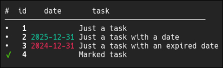

<h1 align="center" id="rusk">rusk</h1>
<p align="center">A minimal cross-platform terminal task manager</p>

<p align="center">
  <a href="https://github.com/tagirov/rusk/actions"></a>&nbsp;
  <a href="https://github.com/tagirov/rusk/releases"></a>&nbsp;
  <a href="https://aur.archlinux.org/packages/rusk"></a>
</p>

<br />

<p align="center"></p>

<br />

- [Install](#install)
- [Basic Usage](#basic-usage)
  - [Working with Multiple Tasks](#working-with-multiple-tasks)
  - [Interactive Editing](#interactive-editing)
  - [Data Safety & Backup](#data-safety--backup)
    - [Automatic Backups](#automatic-backups)
    - [Manual Restore](#manual-restore)
  - [Aliases](#aliases)
- [Configuration](#configuration)
  - [Shell Completion](#shell-completion)
    - [Quick Install (Recommended)](completions/README.md#quick-install-recommended)
    - [Manual Installation](completions/README.md#manual-installation)
      - [Bash](completions/README.md#bash)
      - [Zsh](completions/README.md#zsh)
      - [Fish](completions/README.md#fish)
      - [Nu Shell](completions/README.md#nu-shell)
      - [PowerShell](completions/README.md#powershell)
  - [Database Location](#database-location)

# Install
#### Linux/MacOS/Windows
```bash
cargo install --git https://github.com/tagirov/rusk
```
The binary will be installed to:
- Linux/MacOS: `$HOME/.cargo/bin/rusk`
- Windows: `%USERPROFILE%\.cargo\bin\rusk.exe`

Make sure that these paths are added to your $PATH environment variable to use `rusk` command globally.

#### Arch Linux (AUR)
```bash
paru -S rusk
```

#### Manually
```bash
git clone https://github.com/tagirov/rusk && cd rusk
```
```bash
cargo build --release
```

Linux/MacOS

```bash
sudo install -m 755 ./target/release/rusk /usr/local/bin
```

Windows

```bash
copy .\target\release\rusk.exe "%USERPROFILE%\AppData\Local\Microsoft\WindowsApps\"
```


# Basic Usage

```bash
# Add a new task
rusk add Buy groceries

# Add a task with a deadline
rusk add Finish project report --date 31-12-2025

# Or with short year and slash separator:
rusk add Finish project report --date 31/12/25

# Leading zero for day and month is optional:
rusk add Finish project report --date 1-3-25

# View all tasks
rusk list

# or simply
rusk

# Mark a task as done
rusk mark 1

# Mark a task as undone (toggle)
rusk mark 1

# Edit task text (replace)
rusk edit 1 Complete the project documentation

# Edit task date
rusk edit 1 --date 25/12/2025

# Edit both text and date
rusk edit 1 Update documentation --date 23-12-25

# Delete a task
rusk del 1

# Delete all completed tasks
rusk del --done

# Get help for any command
rusk --help

# Get help for a specific command
rusk add --help
rusk del --done --help 
```

## Working with Multiple Tasks

Multiple task IDs must be comma-separated (no spaces allowed between IDs)

```bash
# Mark multiple tasks as done
rusk mark 1,2,3

# Edit multiple tasks with the same text
rusk edit 1,2,3 Update status to completed

# Delete multiple tasks
rusk del 1,2,3
```

## Interactive Editing

```bash
# Edit task text interactively
rusk edit 1

# Edit task text and date interactively
rusk edit 1 --date

# Interactive editing of tasks in sequence
rusk edit 1,2,3
```


## Data Safety & Backup
#### Automatic Backups
- Every save operation creates a `.json.backup` file
- Backups are stored in the same directory as your database
- Atomic writes prevent data corruption during saves

#### Manual Restore
```bash
# Restore from the automatic backup
rusk restore

# This will:
# 1. Validate the backup file
# 2. Create a safety backup of current database (if valid)
# 3. Restore tasks from backup
```


## Aliases
```bash
rusk a (add)
rusk l (list)
rusk m (mark)
rusk e (edit)
rusk d (del)
rusk r (restore)

-d (--date)
-h (--help)
-V (--version)
```

# Configuration

### Shell Completion

> For detailed installation instructions, see [completions/README.md](completions/README.md).

It provides autocomplete for commands, task IDs, and task text during editing by pressing `<tab>` button.


**Features:**
- Command completion: Autocomplete commands (`add`, `edit`, `mark`, `del`, etc.) and their aliases
- Task ID completion: Tab-complete task IDs for `edit`, `mark`, and `del` commands
- Smart text completion: When typing `rusk edit 3 <tab>`, automatically suggests the current task text for easy editing. (`rusk edit 3<tab>` will complete the ID)
- Flag completion: Autocomplete `--date`, `--done`, etc.
- Date suggestions: When using `--date<tab>` or `-d<tab>` flag, suggests default dates: Today, Tomorrow, One week ahead, Two weeks ahead

**Windows Support:**
- Git Bash: Works with `bash` completions (uses Unix-style paths)
- WSL: Works with `bash`, `zsh`, `fish`, and `nu` completions
- Nu Shell: Works natively on Windows (uses `%APPDATA%\nushell\completions\`)
- PowerShell: Works natively on Windows (uses `Documents\PowerShell\rusk-completions.ps1`)
- CMD: Basic commands work (add, list, mark, del, edit with text/date). Interactive editing (`rusk edit` without arguments) requires Windows 10+ and may have limited functionality. Tab completion is not supported. Colors work on Windows 10+ (build 1511 and later).

### Database Location

By default, rusk stores tasks to:
- Linux/MacOS: `$HOME/.rusk/tasks.json`
- Windows: `%USERPROFILE%\.rusk\tasks.json`

You can customize the database location using the `RUSK_DB` environment variable:

```bash
# Use a custom database file
export RUSK_DB="/path/to/your/tasks.json"

# Use a custom directory (tasks.json will be created inside)
export RUSK_DB="/path/to/your/project/"

# Use different task lists for different projects
cd ~/projects/website
RUSK_DB="./tasks.json" rusk add Fix responsive layout

cd ~/projects/api
RUSK_DB="./tasks.json" rusk add Add authentication endpoint

# Each project has its own task list
```

**Debug Mode:**
When running in debug mode (`cargo run` or debug builds), rusk uses a temporary database location to avoid affecting your production data:
- Linux/MacOS: `$TMPDIR/rusk_debug/tasks.json` (usually `/tmp/rusk_debug/tasks.json`)
- Windows: `%TEMP%\rusk_debug\tasks.json` (usually `C:\Users\<user>\AppData\Local\Temp\rusk_debug\tasks.json`)

In debug mode, the `RUSK_DB` environment variable is ignored, and the database path is printed to the console when the program starts.

<br />

<p align="right"><a href="#rusk">Back to top</a></p>
