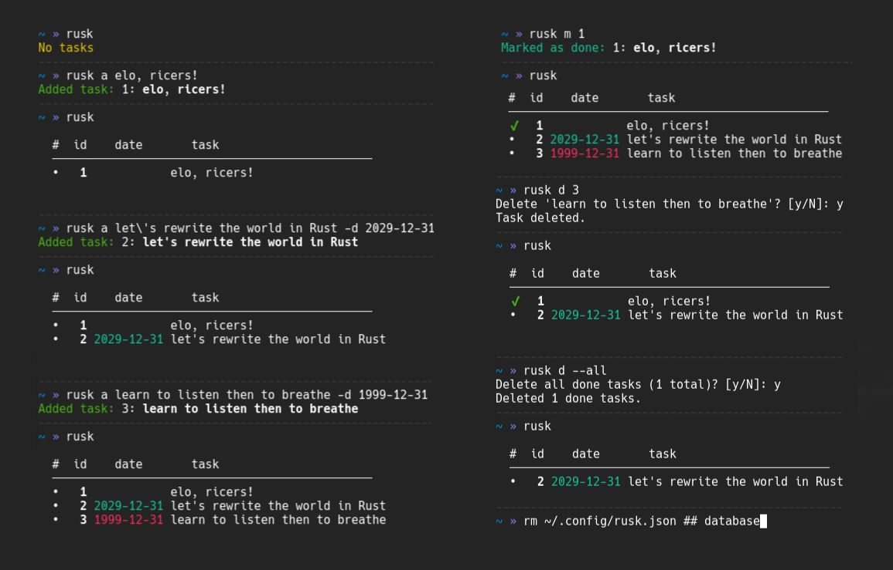

<h1 align="center">rusk</h1>
<p align="center">A cross-platform minimal terminal task manager</p>
<p align="center">
    <a href="https://github.com/tagirov/rusk/releases"></a>
</p>

<p align="center"></p>

# Install
#### Linux/MacOS/Windows
```bash
cargo install --git https://github.com/tagirov/rusk
```
The binary will be installed to: Linux/MacOS -> `$HOME/.cargo/bin/rusk` Windows -> `%USERPROFILE%\.cargo\bin\rusk.exe`
Make sure that these paths are added to your $PATH environment variable to use `rusk` command globally.

#### Arch Linux (AUR)
```bash
paru -S rusk
```

#### Manually
```bash
git clone https://github.com/tagirov/rusk && cd rusk
```
```bash
cargo build --release
```

Linux/MacOS

```bash
sudo install -m 755 ./target/release/rusk /usr/local/bin
```

Windows

```bash
copy .\target\release\rusk.exe "%USERPROFILE%\AppData\Local\Microsoft\WindowsApps\"
```

# Usage

```bash
# Add a task
rusk add pump up the wheel

# With a date
rusk add Remove all dust from the table --date 2025-7-1

# List all tasks. These commands are all the same
rusk list
rusk l
rusk

# Edit a task
rusk edit [id] a new text --date YYYY-MM-DD

# Change only the date
rusk edit [id] --date YYYY-MM-DD

# Mark or unmark a task as done
rusk mark [id]

# Delete a task
rusk del [id]

# Delete all done tasks
rusk del --all
```
## Bulk task operations

All of `edit`, `mark`, and `del` commands support flexible ID input:

```bash
# Space-separated IDs
rusk mark 1 2 5

# Comma-separated IDs  
rusk edit 1,2,5

# Mixed formats
rusk del 1 2,5 8

# Expands to: 1 2 3 4 5 (brace expansion doesn't work in NuShell)
rusk del {1..5}  
```

## Aliases
```bash
rusk a (add)
rusk l (list)
rusk m (mark)
rusk e (edit)
rusk d (del)
rusk r (restore)

-t (--text)
-d (--date)
-h (--help)
-V (--version)
```

## Examples

```bash
# Change the text and date for tasks with IDs 1 and 2
rusk e 1 2 These tasks are hidden now -d 2000-1-1

# Change only the date for tasks with IDs 1, 2, 3, 4
rusk e {1..4} -d 2025-12-31
```

# Configuration
### Database Location

By default, rusk stores tasks to: Linux/MacOS -> `$HOME/.rusk/tasks.json` Windows -> `C:\Users\%USERPROFILE%\.rusk\tasks.json`

You can customize this location using the `RUSK_DB` environment variable:

```bash
# Use a custom database file
export RUSK_DB="/path/to/your/tasks.json"
rusk add My task

# Use a custom directory (tasks.json will be created inside)
export RUSK_DB="/path/to/your/project/"
rusk add Project task

# Or set it for a single command
RUSK_DB="./my_tasks.json" rusk add Another task
```

This proves especially useful for:
- Keeping different task lists for different projects
- Sharing task files between machines
- Testing with temporary databases

# Data Safety & Backup
#### Automatic Backups
- Every save operation creates a `.json.backup` file
- Backups are stored in the same directory as your database
- Atomic writes prevent data corruption during saves

#### Manual Restore
```bash
# Restore from the automatic backup
rusk restore

# This will:
# 1. Validate the backup file
# 2. Create a safety backup of current database (if valid)
# 3. Restore tasks from backup
```
